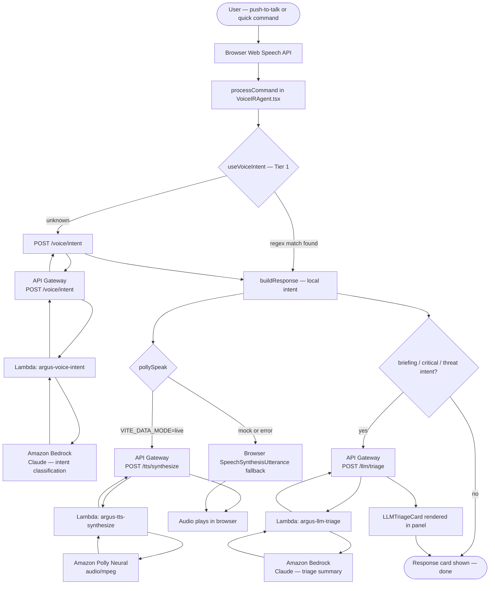
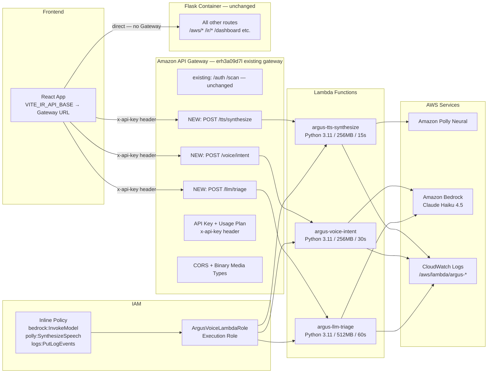

# API Gateway + Lambda — Flow & Checklist
## Argus Voice: TTS, Voice Intent, LLM Triage

**Status:** Planning
**Ref doc:** `API-Gateway-Lambda-Integration.md`

---

## End-to-End Request Flow



---

## AWS Infrastructure Flow



---

## Deployment Checklist

Work through these in order. Each section must be complete before moving to the next.

---

### 1. IAM Setup

- [ ] Open IAM console → Roles → Create role
- [ ] Trusted entity: AWS service → Lambda
- [ ] Skip managed policies — do not attach `AmazonBedrockFullAccess` or `AmazonPollyFullAccess`
- [ ] Add inline permission policy (copy from `API-Gateway-Lambda-Integration.md` — IAM section)
- [ ] Name the role `ArgusVoiceLambdaRole`
- [ ] Confirm the role ARN is saved — needed when creating each Lambda

---

### 2. Lambda — `argus-tts-synthesize`

- [ ] Lambda console → Create function → Author from scratch
- [ ] Runtime: Python 3.11
- [ ] Execution role: existing → `ArgusVoiceLambdaRole`
- [ ] Paste handler code from integration doc (Lambda 1 skeleton)
- [ ] Set environment variables:
  - [ ] `AWS_DEFAULT_REGION` = `us-east-1`
  - [ ] `CORS_ALLOW_ORIGIN` = your frontend domain
- [ ] Set timeout: **15 seconds**
- [ ] Set memory: **256 MB**
- [ ] Deploy function
- [ ] Test with Lambda console test event:
  ```json
  { "body": "{\"text\": \"Test audio.\", \"voice\": \"Matthew\", \"engine\": \"neural\"}" }
  ```
- [ ] Confirm response has `isBase64Encoded: true` and `Content-Type: audio/mpeg`

---

### 3. Lambda — `argus-voice-intent`

- [ ] Lambda console → Create function → Author from scratch
- [ ] Runtime: Python 3.11
- [ ] Execution role: existing → `ArgusVoiceLambdaRole`
- [ ] Paste handler code from integration doc (Lambda 2 skeleton)
- [ ] Set environment variables:
  - [ ] `AWS_DEFAULT_REGION` = `us-east-1`
  - [ ] `BEDROCK_MODEL_ID` = `anthropic.claude-haiku-4-5-20251001`
  - [ ] `CORS_ALLOW_ORIGIN` = your frontend domain
- [ ] Set timeout: **30 seconds**
- [ ] Set memory: **256 MB**
- [ ] Deploy function
- [ ] Test with Lambda console test event:
  ```json
  { "body": "{\"utterance\": \"what is the threat level\", \"context_turns\": [], \"finding_context\": null}" }
  ```
- [ ] Confirm response contains `intent`, `spoken_reply`, `confidence`
- [ ] Confirm `model` in response is NOT `"mock"` (confirms Bedrock is live)

---

### 4. Lambda — `argus-llm-triage`

- [ ] Lambda console → Create function → Author from scratch
- [ ] Runtime: Python 3.11
- [ ] Execution role: existing → `ArgusVoiceLambdaRole`
- [ ] Paste handler code from integration doc (Lambda 3 skeleton)
- [ ] Set environment variables:
  - [ ] `AWS_DEFAULT_REGION` = `us-east-1`
  - [ ] `BEDROCK_MODEL_ID` = `anthropic.claude-haiku-4-5-20251001`
  - [ ] `CORS_ALLOW_ORIGIN` = your frontend domain
- [ ] Set timeout: **60 seconds**
- [ ] Set memory: **512 MB**
- [ ] Deploy function
- [ ] Test with Lambda console test event:
  ```json
  {
    "body": "{\"finding_id\": \"test-001\", \"severity\": \"CRITICAL\", \"finding_type\": \"UnauthorizedAccess:IAMUser\", \"resource_name\": \"arn:aws:iam::123456789012:user/test\", \"description\": \"Suspicious API calls from Tor exit node.\"}"
  }
  ```
- [ ] Confirm `status: "succeeded"` and `model` is NOT `"mock"`

---

### 5. API Gateway — Add Resources to Existing Gateway

> The existing API Gateway (`erh3a09d7l`) already handles `/auth` and `/scan`. Do **not** create a new one — add the 3 new resources to it.

- [ ] API Gateway console → APIs → open `erh3a09d7l`
- [ ] Add resources and methods:
  - [ ] Resource `/tts` → child `/synthesize` → method `POST` → Lambda proxy → `argus-tts-synthesize`
  - [ ] Resource `/voice` → child `/intent` → method `POST` → Lambda proxy → `argus-voice-intent`
  - [ ] Resource `/llm` → child `/triage` → method `POST` → Lambda proxy → `argus-llm-triage`
- [ ] Enable Lambda proxy integration on all 3 methods
- [ ] API Settings → Binary Media Types → confirm `audio/mpeg` is present (add if missing)

---

### 6. CORS

- [ ] Select `/tts/synthesize` → Actions → Enable CORS
  - [ ] `Access-Control-Allow-Origin`: your frontend domain
  - [ ] Allow headers: `Content-Type,x-api-key`
  - [ ] Allow methods: `POST,OPTIONS`
- [ ] Repeat for `/voice/intent`
- [ ] Repeat for `/llm/triage`

---

### 7. API Key + Usage Plan

- [ ] API Keys → Create → name: `argus-dev-key`
- [ ] Copy and save the key value securely
- [ ] Usage Plans → Create plan:
  - [ ] Name: `argus-dev`
  - [ ] Throttle: 50 req/sec burst, 20 req/sec steady
  - [ ] Quota: 10,000 requests/day
- [ ] Add stage to plan (after deploying in next step)
- [ ] Add `argus-dev-key` to the plan

---

### 8. Deploy Stage

- [ ] Actions → Deploy API
- [ ] Redeploy to the **existing stage** (the same one serving `/auth` and `/scan`)
- [ ] Invoke URL stays: `https://erh3a09d7l.execute-api.us-east-1.amazonaws.com/v1`

---

### 9. Frontend Config

- [ ] Update `.env.live`:
  - [ ] `VITE_IR_API_BASE=https://erh3a09d7l.execute-api.us-east-1.amazonaws.com/v1`
  - [ ] `VITE_API_GATEWAY_KEY=your-api-key-value`
- [ ] Add `x-api-key` header to `irFetch()` in `src/services/irEngine.ts`
- [ ] Add `x-api-key` header to `pollySpeak()` fetch call in `src/services/ttsService.ts`
- [ ] Rebuild frontend: `docker compose build --no-cache frontend`
- [ ] Restart app container: `docker compose up -d --force-recreate app`

---

### 10. End-to-End Validation

- [ ] Open Argus panel in browser (Chrome or Edge)
- [ ] Press mic → say "brief me" → confirm Polly audio plays (not browser TTS)
- [ ] Press mic → say "what is the threat level" → confirm spoken response
- [ ] Press CRITICAL quick command → confirm LLMTriageCard appears with real Claude summary
- [ ] Check CloudWatch Logs → `/aws/lambda/argus-tts-synthesize` — confirm invocations logged
- [ ] Check CloudWatch Logs → `/aws/lambda/argus-llm-triage` — confirm no errors
- [ ] Confirm `model` field in triage card is NOT `"mock"`
- [ ] Test fallback: set `VITE_DATA_MODE=mock` → confirm browser TTS kicks in, no Gateway calls

---

### 11. Promote to Staging

- [ ] Deploy API → redeploy or create a `staging` stage on the same gateway
- [ ] Create new API key `argus-staging-key` and usage plan `argus-staging`
- [ ] Update staging environment config with new key
- [ ] Re-run end-to-end validation against staging stage
- [ ] Update `Voice-Incident-Response-Agent.md` Phase 4 checklist items

---

## Quick Reference

| Item | Value |
|---|---|
| Execution role | `ArgusVoiceLambdaRole` |
| Lambda runtime | Python 3.11 |
| Bedrock model | `anthropic.claude-haiku-4-5-20251001` |
| Polly voice | `Matthew` (Neural) |
| Existing API Gateway ID | `erh3a09d7l` |
| Existing Gateway URL | `https://erh3a09d7l.execute-api.us-east-1.amazonaws.com/v1` |
| Binary media type | `audio/mpeg` |
| Auth method | API key via `x-api-key` header |
| Frontend env var (base URL) | `VITE_IR_API_BASE` |
| Frontend env var (key) | `VITE_API_GATEWAY_KEY` |
| CloudWatch log group prefix | `/aws/lambda/argus-*` |
