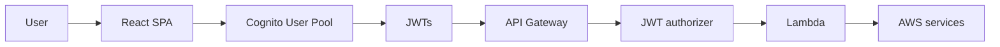

# Backend Cognito & Auth Infrastructure

## Summary

This document describes how the IAM Dashboard uses **Amazon Cognito** for authentication and how that fits into the current frontend and API stack. It is the backend-facing companion to [`infra/cognito/COGNITO_CONFIG.md`](../../infra/cognito/COGNITO_CONFIG.md), which focuses on Terraform resources and deployment inputs.

At a high level we use:

- **Cognito User Pool** for authentication and JWT issuance
- **React SPA (Vite)** with an in-app username/password login UI
- **CloudFront + S3** to serve the SPA in production
- **API Gateway + Lambda** (and/or Flask locally) as the backend API
- **API Gateway JWT authorizers** to validate Cognito-issued bearer tokens on protected routes

---

## Components and responsibilities

- **Cognito User Pool**
  - Users sign in with a **username**.
  - `email` is still a required user attribute.
  - Cognito issues **ID**, **Access**, and **Refresh** tokens.

- **Cognito App Client**
  - Supports the frontend's direct Cognito authentication flow.
  - Provides the audience/client ID used by API Gateway JWT validation.
  - Still keeps callback/logout URLs on the app client configuration because those are standard Cognito settings, even though the current SPA does not use redirect-based login as the primary flow.

- **Hosted UI Domain**
  - Still provisioned by Terraform.
  - Not the primary login experience for the current SPA.
  - Should be treated as supporting Cognito infrastructure, not the main user journey.

- **Frontend SPA**
  - Dev: Vite on `http://localhost:5173/`.
  - Docker dev: `http://localhost:3001/`.
  - Production: CloudFront in front of the S3-hosted SPA.
  - Uses the app's own login form for username/password sign-in.
  - Persists the authenticated session in browser storage so reloads and normal browser restarts keep the user signed in.

- **Backend API**
  - Dev: local API adapter / Flask-based path used for local runs.
  - Prod: API Gateway + Lambda (`iam-dashboard-scanner`).
  - API Gateway now performs JWT validation on protected routes before Lambda runs.
  - Fine-grained authorization inside Lambda is still future work.

---

## Environment variables (frontend)

The current custom login flow depends primarily on:

```bash
VITE_API_GATEWAY_URL=https://<api-id>.execute-api.us-east-1.amazonaws.com/v1
VITE_COGNITO_AUTHORITY=https://cognito-idp.<region>.amazonaws.com/<user_pool_id>
VITE_COGNITO_CLIENT_ID=<cognito_app_client_id>
```

These values let the frontend authenticate directly against Cognito, store the resulting session locally, and send Cognito access tokens to the API.

Legacy redirect/logout variables from the earlier Hosted UI redirect flow may still exist in local env files or older notes. They should not be treated as the primary login path for the current implementation.

---

## High-level architecture



---

## Login and token flow (current)

1. **User opens the dashboard**
   - Dev: `http://localhost:5173/`
   - Docker dev: `http://localhost:3001/`
   - Prod: CloudFront in front of the S3-hosted SPA

2. **User signs in inside the app UI**
   - The login page collects **username** and **password**.
   - The browser stays on the application UI during normal login.

3. **Frontend authenticates against Cognito**
   - The custom auth layer calls Cognito directly using the configured User Pool authority and app client ID.
   - On success Cognito returns **ID**, **Access**, and **Refresh** tokens.

4. **Frontend stores and restores the session**
   - The SPA stores the Cognito session in browser storage.
   - On app load it restores the session and refreshes it when needed.

5. **Authenticated API calls**
   - The SPA sends `Authorization: Bearer <access_token>` in API requests.
   - `src/services/api.ts` reads the access token from the existing frontend auth session store and attaches the header automatically.

6. **API Gateway validates JWTs**
   - Protected HTTP API routes use an API Gateway JWT authorizer backed by the Cognito User Pool issuer and app client audience.
   - If the bearer token is invalid or missing, API Gateway returns `401` before Lambda runs.

7. **Lambda handles the authorized request**
   - Lambda receives requests only after API Gateway JWT validation on protected routes.
   - Fine-grained authorization inside Lambda is still future work.

8. **Sign out**
   - The SPA clears the persisted local session and returns the user to the login page.

---

## Current responsibilities

- **Cognito infrastructure via Terraform**
  - `infra/cognito/` creates the User Pool, app client, hosted UI domain, seeded users, and outputs used elsewhere in the stack.

- **Frontend authentication**
  - The SPA uses a custom in-app Cognito username/password flow rather than redirecting users to Hosted UI for normal login.

- **Protected API routes**
  - API Gateway currently performs JWT validation on protected routes using the Cognito issuer and app client audience.

- **Future backend authorization**
  - Backend/Lambda claim-based authorization remains future work and is not yet the main enforcement layer.

---

## IMPORTANT: CURRENT CONFIGURATION

- **Production website URL**
  - The current production website URL is the CloudFront domain: `https://d33ytnxd7i6mo9.cloudfront.net/`

- **Local / dev URLs**
  - `http://localhost:3001/`
  - `http://localhost:5173/`

- **Direct S3 website endpoint usage**
  - You can use the S3 website endpoint directly, but you may run into issues if you try to sign out or if authentication fails because the S3 URL is not one of the listed callback or logout URLs in Cognito.
  - If that happens, go to the browser address bar and remove everything after the base URL.
  - Example:

```text
http://test-562559071105-us-east-1-an.s3-website-us-east-1.amazonaws.com/login -> ERROR
http://test-562559071105-us-east-1-an.s3-website-us-east-1.amazonaws.com       -> WORKS
```

  - Replace the example above with the actual S3 website endpoint you are testing against.

---

## Future work

- Add finer-grained authorization decisions inside Lambda based on Cognito claims or groups.
- Document exactly which API routes are protected as JWT rollout continues.
- Remove or clean up any remaining legacy Hosted UI env/config paths once they are no longer needed anywhere in the repo.
- Add functionality for resetting your password.
- Add the ability to create an account with attributes such as email, username, password, password reset, and group association.
